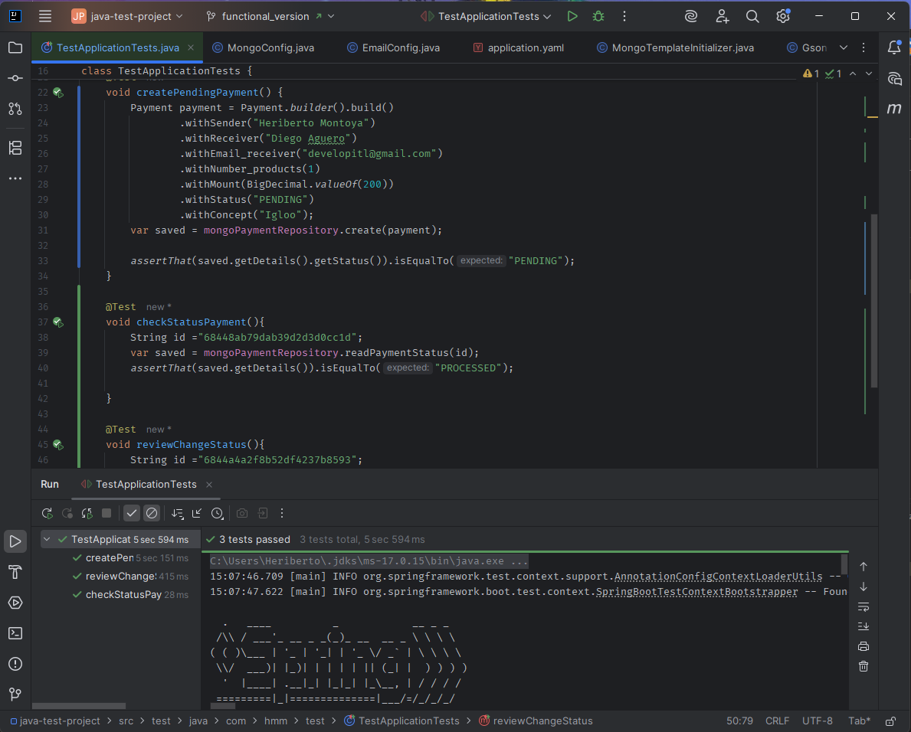

# java-test-project

## Technologies
***
A list of technologies used within the project:
* Java: Version 17
* Spring Boot: Version 3.5
* RabbitMQ: Version 4.1
* MongoDB: Version 8.0

## Installation
***
A little intro about the installation.
```
$ git clone https://github.com/Heriberto-Montoya/java-test-project.git
$ cd java-test-project
$ docker-compose up -d




